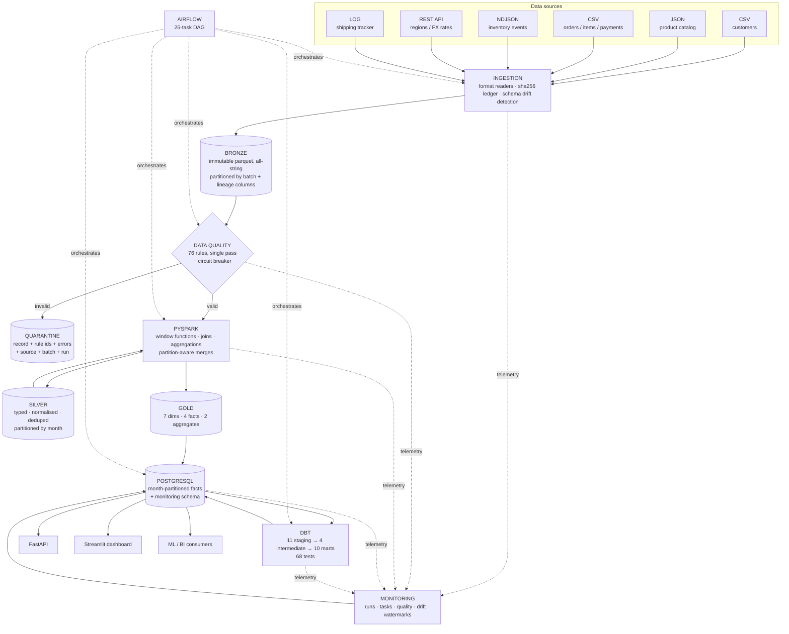

# DataForge

**A production-style data engineering platform for e-commerce and inventory analytics: six heterogeneous sources land in a bronze/silver/gold lake, are validated by 76 declarative rules with a quarantine zone, transformed with PySpark, modelled as a star schema in PostgreSQL, published through dbt marts, orchestrated by Airflow, and served by an API and dashboard.**

All data is **synthetic** and generated reproducibly from a seed. No real people, companies or credentials appear anywhere in this repository.

---

## Contents

1. [Problem statement](#problem-statement) · 2. [Architecture](#architecture) · 3. [Data sources](#data-sources) · 4. [Bronze / Silver / Gold](#bronze--silver--gold) · 5. [Data model](#data-model) · 6. [Pipeline workflow](#pipeline-workflow) · 7. [Tech stack](#tech-stack) · 8. [Data quality](#data-quality-strategy) · 9. [Quarantine](#quarantine-strategy) · 10. [Incremental loading](#incremental-loading) · 11. [Idempotency](#idempotency) · 12. [PySpark](#pyspark-processing) · 13. [Airflow](#airflow-dag) · 14. [dbt](#dbt-models) · 15. [Monitoring](#monitoring) · 16. [API](#api) · 17. [Dashboard](#dashboard) · 18. [Performance](#measured-performance) · 19. [Failure cases](#failure-cases) · 20. [Schema evolution](#schema-evolution) · 21. [Limitations](#known-limitations) · 22. [Local setup](#local-setup) · 23. [Docker](#docker-setup) · 24. [Testing](#testing) · 25. [Example queries](#example-analytics-queries) · 26. [Future work](#future-improvements) · 27. [License](#license)

---

## Problem statement

An e-commerce company's data arrives from systems that were never designed to agree with each other: a CRM exports customers as CSV, a PIM publishes a nested JSON catalog, the order system drops CSV extracts, the warehouse emits a JSON event stream, a third-party service serves reference data over HTTP, and the shipping tracker only writes application logs. The exports contain duplicates, orphan foreign keys, unparseable dates, negative quantities, inconsistent country spellings and truncated lines. Fields appear and disappear without notice.

Analysts need reliable answers anyway: *what was last month's revenue, which categories drive it, which products are declining, which warehouses are about to stock out, who are the most valuable customers, which suppliers ship defects, how long does delivery take by region.*

DataForge is the platform in between. It ingests all six feeds, proves what is trustworthy, quarantines what is not, and publishes an analytics model that answers those questions — incrementally, idempotently, and with every number traceable back to the source line it came from.

## Architecture



Detailed diagrams (component map, ER model, lineage chain): **[docs/architecture.md](docs/architecture.md)**.

## Data sources

Six heterogeneous feeds, delivered in dated batches, all produced by `scripts/generate_data.py`:

| # | Source | Format | Datasets | Notable characteristics |
|---|---|---|---|---|
| 1 | CRM export | CSV | `customers` | Change-data-capture: only new/updated rows per batch |
| 2 | PIM catalog feed | JSON document | `products`, `categories`, `suppliers` | Nested objects (`dimensions_cm`, `attributes`); schema version 2 adds fields |
| 3 | OMS export | CSV | `orders`, `order_items`, `payments` | Late-arriving status updates; prices in the customer's local currency |
| 4 | WMS event stream | NDJSON | `inventory_events` | Sparse keys, at-least-once delivery, truncated/garbage lines |
| 5 | Reference API | REST (`http://`) or documents (`file://`) | `regions`, `warehouses`, `exchange_rates` | Paginated, retried with exponential backoff; daily FX with outage gaps |
| 6 | Shipping tracker | Application log | `shipping_events` | `key=value` lines, quoted values, restart/garbage lines |

Volumes at the default scale (seed `20240101`, two batches covering 2024-01-01 → 2025-12-31):

| Dataset | Raw rows delivered |
|---|---|
| Customers | 22,888 |
| Products | 5,174 |
| Orders | 102,293 |
| Order items | 220,915 |
| Payments | 102,346 |
| Inventory events | 387,453 |
| Shipping events | 285,351 |
| Exchange rates | 7,190 |
| **Total** | **~1.13 M rows / 175 MB** |

Generated data is **not committed**; `data/` is git-ignored and rebuilt from the seed in ~78 s.

### Injected data quality problems

A controlled, seeded fraction of every feed is deliberately corrupted, and the exact counts are written to `data/raw/_manifest/<batch>.json` so tests can assert the pipeline catches them:

missing values · duplicate records (exact and same-key-different-content) · invalid dates (`2024-02-30`, `31/12/2023`, `N/A`) · future dates · inconsistent casing and whitespace · invalid product/customer/warehouse IDs · negative and zero quantities · non-positive and string-typed prices (`"$12.99"`) · malformed JSON lines · malformed nested fields · duplicate order IDs · inconsistent country spellings (`U.S.`, `usa`, `United States of America`) · orphan records · cost above price · line totals that disagree with quantity × price · unknown enum values · missing primary keys.

## Bronze / Silver / Gold

| Layer | What it is | Example |
|---|---|---|
| **Bronze** | Exactly as delivered. Parquet, **every column a string**, nothing cleaned or dropped. Carries `_batch_id`, `_source_file`, `_ingested_at`, `_run_id`, `_row_number`. Immutable; the filename is the content hash. | Raw orders: `order_total` = `"-42.50"`, `status` = `" DELIVERED "` |
| **Silver** | Validated, typed, normalised, deduplicated. One row per business key with the latest version. Invalid rows are in quarantine, not here. Partitioned by month. | Validated orders: `order_total` = `42.50 :: double`, `status` = `"delivered"`, region derived from the customer |
| **Gold** | Analytics-ready star schema: surrogate keys, USD conversion, derived measures, pre-joined attributes. | `fact_orders` with `order_total_usd`, `customer_order_seq`, `is_revenue`; `agg_product_daily_sales` |

Sizes after a full run: bronze 28 MB · silver 33 MB · gold 52 MB · quarantine 25 MB.

## Data model

A star schema with conformed dimensions. Surrogate keys are deterministic `xxhash64` hashes of the business key — which is what makes fact loads idempotent without a key-lookup service.

**Dimensions** — `dim_date` (1,461) · `dim_customer` (19,965) · `dim_product` (4,911) · `dim_category` (48) · `dim_supplier` (150) · `dim_warehouse` (12) · `dim_region` (12)

**Facts** — `fact_orders` (98,452, one per order) · `fact_order_items` (207,946, one per line) · `fact_inventory` (368,815, one per stock event, with a running `on_hand_after`) · `fact_shipping` (91,119, one per shipment with the tracker events pivoted into lifecycle timestamps)

**Aggregates** — `agg_product_daily_sales` · `agg_inventory_position`

In PostgreSQL the facts are RANGE-partitioned by month on their business date. The full ER diagram and the grain/partition rationale for each fact are in [docs/architecture.md](docs/architecture.md#data-model-star-schema).

## Pipeline workflow

```
check_sources → init_warehouse
   → ingest_{customers,catalog,orders,inventory,shipping,reference}
   → detect_schema_drift
   → silver_reference → silver_{customers,products} → silver_{orders,order_items,payments,inventory,shipping}
   → gold_dimensions → gold_facts
   → load_dimensions → load_facts
   → dbt_run → dbt_test
   → warehouse_quality_checks
   → publish (advance watermarks)
```

25 tasks. The graph is declared once as data (`dataforge/pipeline/spec.py`) and drives **both** the CLI runner and the Airflow DAG, so they cannot drift apart — a test asserts it.

```bash
python -m dataforge.pipeline.runner --batch 2025-11-30           # mode inferred from watermarks
python -m dataforge.pipeline.runner --batch 2025-12-31           # → incremental
python -m dataforge.pipeline.runner --batch 2025-12-31 --run-id r1 --from-task load_facts  # resume
python -m dataforge.pipeline.runner --list                       # print the graph
```

## Tech stack

| Layer | Technology | Why |
|---|---|---|
| Processing | **PySpark 3.5+/4.x** | Window functions and partition-aware merges over multi-million-row event data; horizontal scale beyond one machine |
| Storage | **Parquet** (bronze/silver/gold) | Columnar, compressed, partition-prunable; Arrow-native |
| Warehouse | **PostgreSQL 16+** | Declarative month partitioning, `ON CONFLICT` upserts, rich SQL for marts |
| Transformations | **dbt-core + dbt-postgres** | Versioned, tested SQL for business logic close to the warehouse |
| Orchestration | **Apache Airflow 2.10** | Dependencies, retries, backfills, failure callbacks |
| Quality | **Custom declarative rule engine** | Single-pass evaluation on Spark, row-level quarantine with rule attribution — see [why not Great Expectations](#why-a-custom-rule-engine) |
| API | **FastAPI + uvicorn** | Typed, documented read layer over the marts |
| Dashboard | **Streamlit + Plotly** | Business-facing analytics without a frontend build |
| Config | **pydantic-settings** | One typed settings object; no hard-coded credentials |
| Testing | **pytest** | 41 tests including a full end-to-end idempotency run |
| Lint | **ruff** | Lint + format in CI |
| CI | **GitHub Actions** | Lint → tests → e2e → DAG import → compose/image build |

### Why a custom rule engine

Great Expectations (or Soda) would cover the *checking*, but this platform needs three things that are awkward to bolt on: (1) **row-level routing** — every failing row must be written to quarantine carrying the specific rule ids it broke, not just a suite-level pass/fail; (2) **one pass over the data** — all 76 rules compile into a single Spark projection rather than N independent queries over the same DataFrame; (3) **a circuit breaker** that aborts the run when the reject *rate* exceeds a per-dataset budget. The engine is ~200 lines (`dataforge/quality/rules.py`), rules are pure data (`suites.py`), and the catalogue is generated into documentation from the code. A production deployment could swap in GE for the warehouse-level checks without touching the silver path.

## Data quality strategy

Quality is enforced at five stages, with escalating scope:

| Stage | Checks | On failure |
|---|---|---|
| Ingestion (parse) | JSON/log/CSV parseability, required log keys | Line → quarantine (`stage=parse`), file still lands |
| Ingestion (schema) | Delivery vs source schema registry | Missing **required** column → file rejected; new/missing optional → logged |
| Silver (row) | **76 rules**: types, nulls, ranges, enums, referential integrity, dates, cross-column consistency | `reject` → quarantine; `warn` → kept + flagged |
| Silver (dataset) | Reject rate vs circuit breaker (5 % primary, 10 % cascade) | `QualityThresholdError`, run aborts |
| Warehouse | **27 checks**: uniqueness, RI, value ranges, null rates, reconciliation, freshness | `error` → run fails; `warn` → recorded |
| dbt | **68 tests** incl. relationships, accepted values/ranges, two business assertions | Failing test fails `dbt_test`; `publish` never runs |

Every rule carries a severity and a rationale. The full catalogue is **generated from the code**: [docs/data_quality_rules.md](docs/data_quality_rules.md) (`python scripts/export_quality_rules.py`). The design reasoning — reject vs warn, cascade, threshold selection — is in [docs/data_quality.md](docs/data_quality.md).

Representative rules:

| Rule | Severity | Effect |
|---|---|---|
| `order_items.quantity_positive` (`quantity > 0`) | reject | Row quarantined — a negative quantity would corrupt revenue |
| `order_items.unit_price_positive` (`unit_price > 0`) | reject | Row quarantined |
| `orders.order_date_not_future` (`order_date <= ingestion time`) | reject | Row quarantined |
| `orders.customer_known` (FK → silver customers) | reject | Orphan order quarantined; its lines cascade |
| `order_items.product_known` (FK → silver products) | reject | Row quarantined |
| `orders.order_id_format` / uniqueness after `keep_latest` | reject | 100 % unique order ids in the warehouse |
| `customers.email_format` | **warn** | Email nulled, order history preserved |
| `order_items.line_total_consistent` | **warn** | Line total recomputed from qty × price × (1 − discount) |

Measured on the demo data (initial batch): 1,915 parse rejects, 36,184 rule rejects out of 1.06 M rows ingested; no dataset exceeded its circuit breaker; final quality status `pass` with 0 failing checks across silver (76), warehouse (27) and dbt (68).

## Quarantine strategy

Bad records are never deleted. Each one is written as a JSON line under `data/quarantine/<dataset>/batch=<id>/<stage>_<run_id>.ndjson`:

```json
{
  "record": {"order_item_id": "OI-00012345", "order_id": "ORD-0001234", "quantity": "-3",
             "_source_file": "orders/order_items_2025-11-30.csv", "_row_number": 84213},
  "dataset": "order_items",
  "source": "orders/order_items_2025-11-30.csv",
  "batch_id": "2025-11-30",
  "stage": "validate",
  "rule_ids": ["order_items.quantity_positive"],
  "errors": ["quantity must be greater than zero"],
  "detected_at": "2026-09-22T14:19:02.118+00:00",
  "run_id": "final_initial"
}
```

That is enough to find the offending line in the source file, tell the producer which rule it broke, and replay the record after a fix. Per-rule counts land in `monitoring.quality_results` and appear on the dashboard.

## Incremental loading

Five mechanisms, one per layer:

1. **Ingestion — content-hash ledger.** `bronze/_ledger.json` keys on `(dataset, sha256(file))`. A byte-identical re-delivery is skipped.
2. **Silver — partition-scoped merge.** Only the new batch's bronze partitions are read; only the months present in that batch are read back, merged (`union` + keep-latest) and rewritten.
3. **Gold — touched-month scope.** Each silver job reports its written partitions; gold rebuilds only those months. Metrics needing longer history (customer order sequence, running stock, FX forward-fill) compute the window over the full dataset and restrict the *output*, so incremental output is identical to a full rebuild (asserted by a test).
4. **Warehouse — partition-scoped upsert.** Only touched gold partitions are read; PostgreSQL month partitions are created on demand.
5. **dbt — incremental model with look-back.** `daily_sales_summary` re-processes the last 7 days with `delete+insert`, absorbing late-arriving status updates.

`monitoring.watermarks` records the last published batch per dataset; the runner infers the mode from it (no watermark → `initial`, older → `incremental`, same/newer → `rerun`).

Demonstrated: initial load 172 s / 1.06 M rows → incremental 114 s / 67.8 K rows, with the gold scope narrowing from all 24 months to `["2025-10", "2025-11", "2025-12"]`.

## Idempotency

Re-running a batch must not change any number. Guarantees stack at every level:

| Level | Mechanism |
|---|---|
| Ingestion | sha256 ledger → file skipped |
| Bronze | filename is the content hash → a forced re-ingest overwrites the same object |
| Silver | `keep_latest` over the business key → re-delivered rows collapse |
| Gold | deterministic `xxhash64` surrogate keys → same input, same key |
| Warehouse | `INSERT … ON CONFLICT (key) DO UPDATE` → update in place |
| Marts | `delete+insert` on the look-back window |

**Measured on the rerun** (third run, same batch): 0 rows ingested (all 9 files skipped), and in `load_facts`:

```
fact_orders               read=17,946  inserted=0  updated=17,946
fact_order_items          read=37,888  inserted=0  updated=37,888
fact_inventory            read=17,940  inserted=0  updated=17,940
fact_shipping             read=15,466  inserted=0  updated=15,466
agg_product_daily_sales   read=22,983  inserted=0  updated=22,983
agg_inventory_position    read=38,416  inserted=0  updated=38,416
```

Row counts unchanged and 100 % unique afterwards: `fact_orders` 98,452/98,452 · `fact_order_items` 207,946/207,946 · `fact_inventory` 368,815/368,815 · `fact_shipping` 91,119/91,119. Mart revenue identical to the cent.

## PySpark processing

Spark does the work that needs it — not a pandas script in disguise:

| Technique | Where | What it computes |
|---|---|---|
| **Large-scale aggregation** | `agg_product_daily_sales`, `fact_orders` | Product × day revenue/margin/units over 208 K lines; payments and items aggregated per order |
| **Window functions** | `fact_orders` | `row_number()` for the customer's order sequence, `lag()` for days since previous order |
| **Cumulative window** | `fact_inventory` | Running `on_hand_after` = cumulative `sum(quantity_delta)` per (product, warehouse) over the full history |
| **Forward-fill window** | `dense_fx_rates` | `last(value, ignoreNulls)` over a generated date×currency grid to fill FX outage days |
| **Multi-dataset joins** | `fact_order_items` | Five-way join: items × orders × products × FX × dimensions, with broadcast hints on the small sides |
| **Deduplication** | every silver job | Exact-duplicate removal + `keep_latest` by business key and version column |
| **Partition-aware processing** | silver merges, gold facts | Read/write only the months a batch touches; `overwrite_partitions` mode |
| **Referential validation** | rule engine | Anti-join based FK checks with broadcast for small references |

`dataforge/spark/io.py` also contains a documented Windows-only fallback: when Hadoop native libraries are absent, Spark still performs every transformation and only the file write crosses through Arrow. In Docker/Linux the native writer is used.

## Airflow DAG

`dags/dataforge_pipeline.py` builds the DAG from the shared spec: 25 `PythonOperator` tasks in task groups (`ingest`, `silver`, `gold`, `load`, `dbt`), daily at 02:00 UTC, `max_active_runs=1`, `catchup=False`.

* **Retries** — 2 by default with exponential backoff (5 min → 30 min cap); `check_sources` gets 3.
* **Failure handling** — `on_failure_callback` closes the run document as failed; the error and traceback are in `monitoring.task_runs`.
* **Logging** — structured JSON (`DATAFORGE_LOG_FORMAT=json`), every line tagged with `run_id` and `task`.
* **State between tasks** — the shared run document, not XCom payloads (XCom carries only scalar counts).
* **Parameters** — `dag_run.conf` may override `batch_id`, `mode`, `force_ingest`.

No single monolithic task: each ingestion source, each silver dataset and each layer transition is its own retryable unit.

## dbt models

```
staging (11 views)        stg_orders, stg_order_items, stg_customers, stg_products, stg_inventory_events,
                          stg_shipments, stg_regions, stg_warehouses, stg_suppliers, stg_inventory_position, stg_dates
intermediate (4 views)    int_revenue_lines, int_product_period_sales, int_customer_orders, int_shipping_enriched
marts (10 tables)         daily_sales_summary (incremental), monthly_revenue_summary, customer_lifetime_value,
                          product_sales_metrics, category_revenue, regional_performance, inventory_turnover,
                          warehouse_performance, supplier_performance, shipping_performance
```

**68 tests**: `unique`, `not_null`, `relationships`, `accepted_values`, plus custom generic tests (`positive`, `non_negative`, `accepted_range`, `unique_combination`) and two singular business assertions (monthly reconciles with daily; order headers reconcile with their lines within a tolerated quarantine gap).

```bash
dbt run  --profiles-dir dbt --project-dir dbt
dbt test --profiles-dir dbt --project-dir dbt
dbt build --profiles-dir dbt --project-dir dbt --select marts
dbt docs generate --profiles-dir dbt --project-dir dbt && dbt docs serve
```

**Spark vs dbt split:** Spark owns everything that needs row-level quarantine, cross-file windows or partition-aware rewrites (cleaning, dedup, running balances, FX conversion, fact construction). dbt owns business aggregations expressed naturally in SQL over an already-clean warehouse (revenue roll-ups, LTV, turnover, scorecards), where versioned SQL and declarative tests are the better tool.

## Monitoring

Telemetry is written twice — to `data/monitoring/runs/<run_id>.json` (always, even if PostgreSQL is down) and to `monitoring.*` (what the API and dashboard read):

`pipeline_runs` (status, duration, rows ingested/rejected/quarantined/loaded, quality status) · `task_runs` (per-task status, duration, row counts, error) · `quality_results` (per-rule failure counts and rates vs threshold) · `schema_events` (drift with severity) · `ingestion_batches` (file ledger mirror) · `watermarks` (last published batch, high-water timestamps).

Surfaced via `/pipeline/status`, `/pipeline/runs`, `/pipeline/quality` and the dashboard's **Pipeline Health** page.

## API

```bash
uvicorn api.main:app --port 8000     # docs at /docs
```

| Endpoint | Returns |
|---|---|
| `GET /health` | Service + database status, last successful run |
| `GET /metrics/sales?granularity=daily\|monthly&from=&to=` | Revenue, orders, margin, AOV, customers + totals |
| `GET /metrics/sales/categories?month=` | Revenue and share by category |
| `GET /metrics/sales/products?declining=true` | Product performance / declining products |
| `GET /metrics/inventory` | Stock summary, low-stock products, warehouse positions |
| `GET /metrics/customers` | Top customers by LTV, lifecycle and segment breakdowns |
| `GET /metrics/shipping?month=` | Delivery time and on-time rate by region and carrier |
| `GET /metrics/suppliers` | Defect and return rates per supplier |
| `GET /pipeline/status` | Last run, its tasks, quality summary, drift events, watermarks |
| `GET /pipeline/runs` · `GET /pipeline/quality` | Run history · per-rule results |

## Dashboard

```bash
streamlit run dashboard/app.py --server.port 8501
```

Six pages — **Overview** (total revenue, revenue orders, active customers, inventory value, average order value, average delivery time; revenue over time, revenue by category, top products, regional performance), **Sales** (daily revenue with 7-day average, monthly revenue by category, declining products, monthly summary), **Inventory** (value and levels by warehouse, low-stock and high-velocity tables, turnover by category), **Customers** (lifecycle, value by segment, top customers), **Shipping & Suppliers** (delivery time by region and carrier, trend, supplier defect table), **Pipeline Health** (last run, status, duration, rows processed/quarantined, quality status, task-duration chart, quality rule hits, schema drift, run history).

## Measured performance

Hardware: Windows 11, 16 logical cores, 15.6 GB RAM, Python 3.13, PySpark 4.1.1 (`local[*]`), PostgreSQL 18, data on a local SSD. **All numbers below were measured on this machine, not estimated.**

### End-to-end pipeline

| Run | Mode | Wall time | Rows ingested | Parse rejects | Rule rejects | Rows loaded | Quality |
|---|---|---|---|---|---|---|---|
| `final_initial` (2025-11-30) | initial | **172.3 s** | 1,064,208 | 1,915 | 36,184 | 912,655 | pass |
| `final_incremental` (2025-12-31) | incremental | **114.3 s** | 67,803 | 104 | 2,177 | 177,198 | pass |
| `final_rerun` (2025-12-31) | rerun | **117.8 s** | 0 (all skipped) | 0 | 2,177 | 177,198 (0 inserts) | pass |

Initial load throughput: **~6,200 rows/s end-to-end**, including Spark start-up, validation of 76 rules across 7 datasets, the full gold rebuild, the PostgreSQL load and all dbt models and tests.

Per-task breakdown of the initial run (seconds): silver_reference 24.0 (includes JVM start-up) · gold_facts 22.1 · load_facts 22.0 · dbt_run 15.4 · silver_inventory 12.6 · silver_order_items 10.2 · dbt_test 9.9 · silver_shipping 9.6 · silver_orders 9.5 · silver_products 8.1 · silver_customers 7.5 · ingest_inventory 3.4 · ingest_shipping 2.7 · gold_dimensions 2.4 · warehouse_quality_checks 1.3 · everything else < 1.

Data generation: **78.3 s** for 1.13 M rows across 6 formats (175 MB).

### pandas vs PySpark

Identical workload on identical inputs — cast, dedup via window, rule checks, two joins, derived measures, product×day aggregation, cumulative window. Best of two runs each; `benchmarks/benchmark_pandas_vs_spark.py`, raw results in `benchmarks/results/pandas_vs_spark.json`.

| Scale | Rows in | pandas | PySpark | pandas rows/s | PySpark rows/s |
|---|---|---|---|---|---|
| ×1 | 220,254 | **1.23 s** | 3.88 s | 179,068 | 56,766 |
| ×4 | 881,016 | **4.03 s** | 4.42 s | 218,614 | 199,324 |
| ×10 | 2,202,540 | 10.30 s | **6.54 s** | 213,838 | 336,779 |

Spark session start-up: 6.59 s (excluded from the table). Both engines produced identical outputs (same reject count, same 153,436 output rows) — the benchmark asserts this.

**Reading:** pandas wins below ~1 M rows, where Spark's JVM and scheduling overhead dominates. The crossover is near 900 K rows; at 2.2 M rows Spark is **1.6× faster** and its throughput is still rising while pandas' is flat. The real argument is the next order of magnitude: pandas is bounded by one machine's RAM, while the same Spark code runs unchanged against a cluster. For this project's honest scale, Spark is chosen for the *processing model* (partition-aware merges, windows over full history, horizontal scale), not for a speed win at 200 K rows.

### Test suite

41 tests: **40 passed, 1 skipped** (Airflow DagBag — Airflow only runs in the Docker image) in **368 s**, including the full initial → incremental → rerun end-to-end run against an isolated database.

## Failure cases

Verified behaviours (see [docs/pipeline.md](docs/pipeline.md#error-handling) for the full table):

| Failure | Behaviour |
|---|---|
| Missing source file | `check_sources` fails fast naming the paths; 3 retries |
| Reference API outage | Exponential backoff (0.5→4 s), then a clear `SourceError`; tested with a mock transport |
| Malformed JSON / log lines | Quarantined individually (`stage=parse`); the rest of the file still lands — 1,915 such lines in the demo run |
| Structurally invalid file | `SourceError`; only that dataset's task fails |
| Breaking schema drift | `SchemaDriftError` before silver; nothing downstream sees partial data |
| Duplicate delivery | Skipped via the ledger and logged |
| Source-wide corruption | Circuit breaker (`QualityThresholdError`) aborts the run — this actually fired during development when `order_items` hit 6.4 % against a 5 % budget |
| Spark job failure | Error + traceback in `monitoring.task_runs`; run marked failed |
| Database unreachable | `DatabaseUnavailable` with a **redacted** DSN; monitoring degrades to file-only so the failure is still recorded |
| dbt test failure | Failing node names extracted and raised; `publish` never runs — this fired during development on the header/lines reconciliation assertion |
| Warehouse check failure | `error` severity fails the run; marts keep their previous values |

Because every task is idempotent, recovery is always "fix and re-run" — never a manual restore.

## Schema evolution

The source schema registry (`dataforge/ingestion/schemas.py`) is the contract:

| Change | Severity | Behaviour |
|---|---|---|
| New column | INFO | Kept in bronze, recorded in `monitoring.schema_events`, **ignored by silver** until the registry is updated. Nothing breaks, nothing is lost. |
| Optional column missing | WARN | Filled with NULL, recorded |
| Required column missing | ERROR | File rejected; `detect_schema_drift` fails the run |

Exercised for real in the demo: batch 2 adds `eco_rating` to products and `promo_campaign` to orders. The incremental run logged

```
WARNING new source columns detected; kept in bronze, ignored by silver until the registry
        is updated {"columns": ["products.eco_rating", "orders.promo_campaign"]}
```

and completed successfully, with both events recorded in `monitoring.schema_events`. Adopting a field is then a reviewed change (registry + silver projection), and backfilling needs no new delivery — bronze already has the data.

## Known limitations

* **Dimensions are SCD type 1.** A customer who moves region overwrites their old row, so historical facts re-attribute. SCD2 would need `valid_from`/`valid_to` and a key lookup at fact build time.
* **Surrogate keys are content hashes, not a sequence.** Cheap and idempotent, but they encode the business key — so a key change creates a new dimension row rather than updating one.
* **Single-machine Spark.** Everything runs in `local[*]`. The code is cluster-ready (a `spark` compose profile starts a standalone master/worker), but the cluster path is not exercised in the measurements above.
* **Batch only.** No streaming ingestion; the event sources are simulated as batch deliveries even though they are event-shaped.
* **The Windows Arrow write fallback holds a dataset in driver memory.** It exists so the project runs on a Windows host without `winutils.exe`; Linux/Docker uses the native writer. Datasets beyond driver memory need the native path.
* **dbt marts are mostly full-refresh.** Only `daily_sales_summary` is incremental; the others are small enough to rebuild, but at 100× volume several would need incremental strategies.
* **No orchestrated backfill range.** Batches are processed one at a time; a multi-month backfill means looping the runner.
* **Quarantine has no replay tool.** Records carry everything needed to replay, but re-submitting them after a producer fix is a manual step.
* **Docker was not run on this machine.** Docker Desktop is not installed here, so the compose stack is validated by `docker compose config` and image builds in CI, not by a local `docker compose up`. See [Docker setup](#docker-setup).

## Local setup

**Prerequisites:** Python 3.11+, Java 17+ (for PySpark), PostgreSQL 14+ running locally.

```bash
git clone <your-fork-url> dataforge && cd dataforge

python -m venv .venv && . .venv/bin/activate      # Windows: .venv\Scripts\activate
pip install -r requirements.txt
pip install --no-deps -e .

cp .env.example .env                               # then edit POSTGRES_* for your server
createdb dataforge                                 # or: psql -c "CREATE DATABASE dataforge;"

python scripts/generate_data.py                    # ~78 s → data/raw (175 MB, git-ignored)
python -m dataforge.pipeline.runner --batch 2025-11-30   # initial load  (~3 min)
python -m dataforge.pipeline.runner --batch 2025-12-31   # incremental   (~2 min)

uvicorn api.main:app --port 8000                   # → http://localhost:8000/docs
streamlit run dashboard/app.py --server.port 8501  # → http://localhost:8501
```

Inspect the layers:

```bash
ls data/bronze/orders/                  # batch=2025-11-30/ batch=2025-12-31/
ls data/silver/orders/                  # order_month=2024-01/ ... order_month=2025-12/
ls data/gold/                           # dim_* fact_* agg_*
head -1 data/quarantine/order_items/batch=2025-11-30/validate_*.ndjson | python -m json.tool
python -c "import pyarrow.dataset as ds,glob; print(ds.dataset(glob.glob('data/gold/fact_orders/**/*.parquet',recursive=True)).to_table().num_rows)"
psql -d dataforge -c "SELECT * FROM analytics_marts.monthly_revenue_summary ORDER BY year_month DESC LIMIT 5;"
```

A smaller dataset for a quick loop: `python scripts/generate_data.py --scale 0.1`.

## Docker setup

```bash
cp .env.example .env        # set POSTGRES_PASSWORD and AIRFLOW_ADMIN_PASSWORD
docker compose up -d        # postgres, reference-api, airflow (web+scheduler), api, dashboard

docker compose run --rm pipeline python scripts/generate_data.py
docker compose run --rm pipeline python -m dataforge.pipeline.runner --batch 2025-11-30
docker compose run --rm dbt test

# Airflow UI  http://localhost:8080   (admin / AIRFLOW_ADMIN_PASSWORD)
# API         http://localhost:8000/docs
# Dashboard   http://localhost:8501
# Mock source API http://localhost:8081/docs

docker compose --profile spark up -d    # optional standalone Spark master + worker
docker compose down -v                  # stop and remove volumes
```

Services: `postgres` (16-alpine, with an `airflow` metadata DB), `reference-api` (the mock SOURCE 5, with `REFERENCE_API_FAIL_RATE` to simulate outages), `pipeline`/`dbt` (one-shot tools), `api`, `dashboard`, `airflow-init`/`airflow-webserver`/`airflow-scheduler`, optional `spark-master`/`spark-worker`.

**Environment caveat:** Docker Desktop is not installed on the machine this project was built on, so `docker compose up` was **not** executed here. The compose file is validated with `docker compose config` and the application image is built in CI (`.github/workflows/ci.yml`, job `docker-config`). The local, non-Docker path above is the one that was run end to end.

## Testing

```bash
pytest                       # everything (~6 min)
pytest -m "not spark"        # fast, no JVM
pytest -m "not e2e"          # skip the full pipeline run
pytest -m e2e                # only the end-to-end initial → incremental → rerun test
ruff check . && ruff format --check .
```

Coverage by area: data generation determinism and defect manifest · each source reader incl. malformed input · API client retry/backoff (mock transport) · schema drift classification · bronze metadata, ledger and duplicate protection · all nine rule check types and the circuit breaker · silver cleaning, dedup, keep-latest, quarantine contents · incremental merge and partition pruning · gold fact consistency (running balances, windows, FK closure) · incremental gold == full rebuild · loader idempotency and partition creation · 27 warehouse checks · dbt marts answering each business question · every API endpoint · pipeline spec/DAG consistency · monitoring tracker · **full end-to-end initial → incremental → rerun idempotency**.

Tests that need PostgreSQL skip automatically when no server is reachable; the pure-Python suite runs anywhere.

## Example analytics queries

```sql
-- Monthly revenue and growth
SELECT year_month, revenue_usd, gross_margin_pct, revenue_mom_growth
FROM analytics_marts.monthly_revenue_summary ORDER BY year_month DESC LIMIT 12;

-- Which categories drive revenue
SELECT parent_category_name, sum(revenue_usd) AS revenue_usd
FROM analytics_marts.category_revenue GROUP BY 1 ORDER BY 2 DESC;

-- Products with declining sales (last 90 days vs prior 90)
SELECT product_name, revenue_prior_90d, revenue_last_90d, round(revenue_trend_ratio, 2) AS ratio
FROM analytics_marts.product_sales_metrics
WHERE is_declining ORDER BY revenue_prior_90d DESC LIMIT 20;

-- Warehouses with low inventory
SELECT warehouse_name, on_hand_units, skus_out_of_stock, round(capacity_utilisation, 3) AS utilisation
FROM analytics_marts.warehouse_performance ORDER BY skus_out_of_stock DESC;

-- Highest lifetime value customers
SELECT customer_id, full_name, total_orders, net_lifetime_value_usd, lifecycle_stage
FROM analytics_marts.customer_lifetime_value ORDER BY net_lifetime_value_usd DESC LIMIT 20;

-- Suppliers with the highest defect rate
SELECT supplier_name, units_received, units_defective, round(defect_rate, 4) AS defect_rate
FROM analytics_marts.supplier_performance WHERE units_received > 1000 ORDER BY defect_rate DESC LIMIT 10;

-- Average delivery time by region
SELECT region_name,
       round(sum(avg_delivery_days * delivered) / nullif(sum(delivered), 0), 2) AS avg_days,
       round(sum(on_time_rate * delivered) / nullif(sum(delivered), 0), 3) AS on_time_rate
FROM analytics_marts.shipping_performance GROUP BY 1 ORDER BY 2;

-- High sales velocity but low inventory
SELECT product_name, on_hand_units, velocity_units_per_day, days_of_cover
FROM analytics_marts.inventory_turnover
WHERE high_velocity_low_stock ORDER BY days_of_cover LIMIT 20;

-- Inventory turnover ratio by category
SELECT category_name, round(avg(turnover_ratio_90d), 2) AS turnover_90d
FROM analytics_marts.inventory_turnover
WHERE turnover_ratio_90d IS NOT NULL GROUP BY 1 ORDER BY 2 DESC;

-- What did the pipeline quarantine, and why?
SELECT dataset, rule_id, failed_rows, round(failure_rate::numeric, 5) AS rate
FROM monitoring.quality_results
WHERE stage = 'silver' AND failed_rows > 0 ORDER BY failed_rows DESC LIMIT 15;
```

## Future improvements

* SCD type 2 on `dim_customer` and `dim_product` with effective dating
* Streaming ingestion (Kafka + Spark Structured Streaming) for the inventory and shipping event sources
* Open table format (Delta Lake or Apache Iceberg) for ACID merges, time travel and schema evolution in the lake itself
* A quarantine replay CLI that re-submits fixed records through validation
* Column-level lineage export (OpenLineage / Marquez) instead of documented lineage
* Anomaly detection on the quality metrics (alert when a rule's failure rate deviates from its own history)
* Backfill orchestration for a date range, with parallel batch execution
* A feature store view of `fact_order_items` + `dim_customer` for churn/propensity models
* Cost- and skew-aware Spark tuning (AQE hints, salting on hot product keys) once on a real cluster

## License

MIT — see [LICENSE](LICENSE).

## Third-party attribution

Built with [Apache Spark](https://spark.apache.org/) (Apache-2.0), [Apache Airflow](https://airflow.apache.org/) (Apache-2.0), [PostgreSQL](https://www.postgresql.org/) (PostgreSQL License), [dbt-core](https://github.com/dbt-labs/dbt-core) (Apache-2.0), [Apache Arrow / PyArrow](https://arrow.apache.org/) (Apache-2.0), [pandas](https://pandas.pydata.org/) (BSD-3-Clause), [NumPy](https://numpy.org/) (BSD-3-Clause), [FastAPI](https://fastapi.tiangolo.com/) (MIT), [Starlette](https://www.starlette.io/) (BSD-3-Clause), [uvicorn](https://www.uvicorn.org/) (BSD-3-Clause), [Streamlit](https://streamlit.io/) (Apache-2.0), [Plotly](https://plotly.com/python/) (MIT), [psycopg](https://www.psycopg.org/) (LGPL-3.0), [pydantic](https://docs.pydantic.dev/) (MIT), [httpx](https://www.python-httpx.org/) (BSD-3-Clause), [pytest](https://pytest.org/) (MIT) and [ruff](https://docs.astral.sh/ruff/) (MIT). All pipeline logic, data model, quality rules, generators, orchestration and documentation in this repository are original work.

---

*All data in this project is synthetic and generated from a seed. It does not describe real people, companies, or transactions.*
