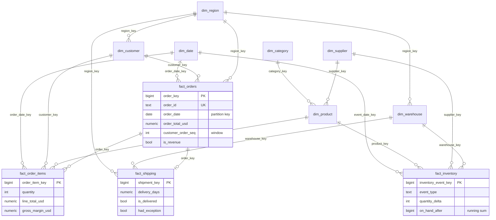

# DataForge architecture

## System diagram

```mermaid
flowchart TB
    subgraph SRC["Data sources (synthetic, reproducible)"]
        S1["SOURCE 1<br/>customers CSV<br/><i>CRM export</i>"]
        S2["SOURCE 2<br/>product catalog JSON<br/><i>PIM feed, nested</i>"]
        S3["SOURCE 3<br/>orders / items / payments CSV<br/><i>OMS export</i>"]
        S4["SOURCE 4<br/>inventory events NDJSON<br/><i>WMS stream</i>"]
        S5["SOURCE 5<br/>regions / FX REST API<br/><i>retry + backoff</i>"]
        S6["SOURCE 6<br/>shipping tracker logs<br/><i>key=value lines</i>"]
    end

    subgraph ING["Ingestion layer"]
        RD["Format readers<br/>csv / json / ndjson / log / api"]
        LG["Ingestion ledger<br/><i>sha256 per file - duplicate protection</i>"]
        SD["Schema registry + drift detection<br/><i>new / missing columns</i>"]
    end

    BR[("BRONZE<br/>parquet, all-string, immutable<br/>partitioned by batch<br/><i>+ lineage columns</i>")]

    subgraph DQ["Data quality (Spark)"]
        RUL["Rule engine<br/>72 declarative rules<br/><i>one pass, reject | warn</i>"]
        CB{"Circuit breaker<br/>reject rate > threshold?"}
    end

    QZ[("QUARANTINE<br/>NDJSON: record + rule_ids<br/>+ errors + source + batch + run")]
    SI[("SILVER<br/>typed, normalised, deduped<br/>partitioned by month"))]
    GO[("GOLD<br/>star schema: 7 dims, 4 facts,<br/>2 aggregates"))]

    subgraph SPK["PySpark processing"]
        SJ["Silver jobs<br/><i>casts, alias maps, keep-latest,<br/>referential joins</i>"]
        GJ["Gold jobs<br/><i>window functions, FX forward-fill,<br/>running stock, 5-way joins</i>"]
    end

    PG[("PostgreSQL<br/>warehouse.* (month-partitioned)<br/>analytics_marts.* (dbt)<br/>monitoring.*")]
    DBT["dbt<br/>11 staging -> 4 intermediate -> 10 marts<br/><i>68 tests</i>"]

    subgraph CONS["Consumers"]
        API["FastAPI<br/>/metrics/*, /pipeline/*"]
        DASH["Streamlit dashboard<br/>6 pages"]
        ML["ML / BI<br/><i>SQL on marts</i>"]
    end

    AF["Apache Airflow<br/><i>25-task DAG, retries,<br/>failure callbacks</i>"]
    MON["Monitoring<br/><i>runs, tasks, quality,<br/>schema events, watermarks</i>"]

    S1 & S2 & S3 & S4 & S5 & S6 --> RD
    RD --> LG --> SD --> BR
    BR --> RUL
    RUL -->|"invalid rows"| QZ
    RUL -->|"valid rows"| CB
    CB -->|"under threshold"| SJ
    CB -->|"over threshold"| FAIL["Fail the run<br/><i>nothing is published</i>"]
    SJ --> SI --> GJ --> GO --> PG --> DBT --> PG
    PG --> API & DASH & ML
    AF -.orchestrates.-> ING & DQ & SPK & PG & DBT
    ING & DQ & SPK & PG & DBT -.emit telemetry.-> MON --> PG
```

## Layered flow

```
raw files            ->  ingestion (format readers, ledger, drift)   ->  bronze
bronze               ->  rule engine (Spark)                          ->  valid | quarantine
valid                ->  silver jobs (normalise, type, dedup, merge)  ->  silver
silver               ->  gold jobs (dims, facts, aggregates)          ->  gold
gold                 ->  loader (COPY + upsert)                       ->  PostgreSQL warehouse
warehouse            ->  dbt (staging, intermediate, marts)           ->  analytics_marts
analytics_marts      ->  API / dashboard / ML
every step           ->  monitoring (runs, tasks, quality, schema, watermarks)
```

## Storage layers

| Layer | Location | Format | Contract | Rewritten |
|---|---|---|---|---|
| **Bronze** | `data/bronze/<dataset>/batch=<id>/` | parquet, every column `string` | As delivered. Nothing cleaned, nothing dropped (unparseable lines go to quarantine). Lineage columns `_batch_id`, `_source_file`, `_ingested_at`, `_run_id`, `_row_number`. | Never (append-only; the file name is the content hash) |
| **Silver** | `data/silver/<dataset>/[<partition>=...]/` | parquet, typed | Valid, normalised, deduplicated, one row per business key with the latest version. Carries `quality_warnings`. | Only the partitions touched by the batch |
| **Gold** | `data/gold/<table>/[<month>=...]/` | parquet, typed | Analytics-ready star schema; surrogate keys, USD conversions, derived measures. | Only the touched months |
| **Quarantine** | `data/quarantine/<dataset>/batch=<id>/<stage>_<run>.ndjson` | NDJSON | One record per rejected row: original record, rule ids, error messages, source file, batch, stage, run, timestamp. | Append-only |
| **Warehouse** | PostgreSQL `warehouse.*` | tables, month range-partitioned | Serving copy of gold. Upserted by business key. | Partition-level upsert |
| **Marts** | PostgreSQL `analytics_marts.*` | tables/views (dbt) | Business questions answered directly. | `daily_sales_summary` incremental, rest full |

## Why each layer exists

* **Bronze keeps the raw text.** A bad cast can then be fixed by re-running silver instead of re-requesting the source file, and the exact bytes that produced a bad row are always recoverable.
* **Silver is the contract for downstream code.** One row per key, typed, normalised; anything that could not meet the contract is in quarantine with a reason.
* **Gold is shaped for reading, not for writing.** Conformed dimensions, pre-joined facts, pre-computed measures - so the marts and the API never re-derive business logic.
* **Quarantine replaces deletion.** Rejects are data about the producers; they drive the defect dashboards and can be replayed after a fix.

## Data model (star schema)



Grain of each fact:

| Fact | Grain | Partition key | Why that key |
|---|---|---|---|
| `fact_orders` | one order (latest version) | `order_date` (month) | Almost every query filters or groups by order date; late updates land in the order's own month |
| `fact_order_items` | one order line | `order_date` (month, inherited from the header) | Keeps a line in the same partition as its header, so month-scoped joins never cross partitions |
| `fact_inventory` | one inventory event | `event_date` (month) | Events are append-heavy and always queried by period |
| `fact_shipping` | one shipment (events pivoted to a lifecycle) | `order_date` (month) | Aligns delivery performance with the order month used by sales analysis |

Dimensions are small and rebuilt in full each run (SCD type 1). Surrogate keys are deterministic `xxhash64` values of the business key, which is what makes fact loads idempotent without a key-lookup service.

## Lineage

A gold metric can always be traced back to a raw line:

```
analytics_marts.monthly_revenue_summary.revenue_usd
  <- analytics_marts.daily_sales_summary.revenue_usd            (dbt, incremental)
  <- analytics_staging.stg_orders.order_total_usd               (dbt view)
  <- warehouse.fact_orders.order_total_usd                      (loader upsert)
  <- data/gold/fact_orders/order_month=YYYY-MM/                 (Spark: order_total x FX rate)
  <- data/silver/orders/order_month=YYYY-MM/                    (Spark: typed, validated, deduped)
     + data/silver/exchange_rates/                              (forward-filled daily FX)
  <- data/bronze/orders/batch=<id>/orders-<sha12>.parquet       (raw strings + _source_file, _row_number)
  <- data/raw/orders/orders_<batch>.csv                         (line _row_number)
```

`_source_file` and `_row_number` survive from bronze into silver, and `_batch_id` reaches the facts, so any suspicious number in a mart can be tied to a source file and line number. Rejected rows carry the same context in quarantine.

## Component map

| Path | Responsibility |
|---|---|
| `dataforge/generators/` | Reproducible synthetic sources + controlled defect injection |
| `dataforge/ingestion/sources/` | One reader per format; API client with retries |
| `dataforge/ingestion/schemas.py` | Source schema registry + drift classification |
| `dataforge/ingestion/bronze.py` | Bronze landing, lineage columns, ledger |
| `dataforge/quality/rules.py` | Declarative rule engine (single-pass evaluation) |
| `dataforge/quality/suites.py` | The rule catalogue (72 rules) |
| `dataforge/quality/quarantine.py` | Quarantine writer/reader |
| `dataforge/quality/warehouse_checks.py` | Post-load checks against PostgreSQL |
| `dataforge/spark/silver/` | Per-dataset silver jobs on a shared template |
| `dataforge/spark/gold/` | Dimensions, facts, aggregates |
| `dataforge/warehouse/` | DDL + idempotent loader |
| `dataforge/monitoring/tracker.py` | Run/task/quality/schema telemetry |
| `dataforge/pipeline/` | Task graph (spec), task implementations, CLI runner |
| `dags/` | Airflow DAG generated from the same spec |
| `dbt/` | staging -> intermediate -> marts + tests |
| `api/`, `dashboard/` | Serving layer |
