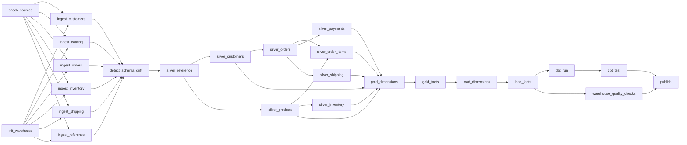

# Pipeline design

## The task graph

The graph lives in `dataforge/pipeline/spec.py` as data. The CLI runner and the Airflow DAG
are both generated from it, so they cannot drift apart (asserted by `tests/test_pipeline.py`).



25 tasks. `check_sources` retries 3 times (a flaky reference API is the common cause),
everything else 2 times with exponential backoff.

## Running it

```bash
python -m dataforge.pipeline.runner --batch 2025-11-30                    # mode inferred
python -m dataforge.pipeline.runner --batch 2025-12-31 --mode incremental # forced
python -m dataforge.pipeline.runner --batch 2025-12-31 --tasks silver_orders,gold_facts
python -m dataforge.pipeline.runner --batch 2025-12-31 --run-id run_x --from-task load_facts  # resume
python -m dataforge.pipeline.runner --list                                # print the graph
```

In Airflow the same graph runs as `dataforge_pipeline` (daily 02:00 UTC). `batch_id`
defaults to the logical date; `dag_run.conf` can override `batch_id`, `mode` and
`force_ingest`.

## Incremental processing

Three independent mechanisms, one per layer:

**1. Ingestion - content-hash ledger.** `bronze/_ledger.json` maps `(dataset, sha256(file))`
to what was landed. A byte-identical delivery is skipped; a changed file with the same name
is a new entry. This is what makes a re-run cheap and safe.

**2. Silver - partition-scoped merge.** Only the bronze partitions of the current batch are
read. Event datasets are partitioned by month; the job reads back **only the months present
in the new batch**, merges (`union` + `keep_latest`), and rewrites just those partitions.
A December batch touching 2025-12 never reads 2024. Master data (customers, products) is
small, so it uses a full snapshot merge.

**3. Gold - touched-month scope.** Each silver job reports which partitions it wrote; the
gold step converts that into the set of months to rebuild. Metrics that need history beyond
the month (customer order sequence, running stock, FX forward-fill) compute their window
over the **full** silver dataset and then restrict the *output* to the touched months - so an
incremental run produces exactly the same rows as a full rebuild. That equality is asserted
by `test_incremental_gold_equals_full_rebuild_for_touched_month`.

**4. Warehouse - partition-scoped upsert.** The loader receives the touched months and only
reads those gold partitions; PostgreSQL partitions are created on demand.

**5. dbt - incremental model with a look-back window.** `daily_sales_summary` re-processes
the last `incremental_lookback_days` (default 7) days using `delete+insert`, which absorbs
late-arriving status updates without a full rebuild. Everything else is a view or a small
table, cheap to rebuild.

### Watermarks

`monitoring.watermarks` stores, per dataset, the last published `batch_id` and the maximum
business timestamp. The runner uses it to infer the mode:

| Watermark | Requested batch | Mode |
|---|---|---|
| none | any | `initial` (full rebuild) |
| `2025-11-30` | `2025-12-31` | `incremental` |
| `2025-12-31` | `2025-12-31` | `rerun` |

## Idempotency

Re-running a batch must not change the numbers. Four guarantees stack up:

| Level | Mechanism | Effect of a second run |
|---|---|---|
| Ingestion | sha256 ledger | The file is skipped (`skipped=True`), bronze untouched |
| Bronze file naming | `<dataset>-<sha256[:12]>.parquet` | Even a forced re-ingest overwrites the same object instead of adding one |
| Silver | `keep_latest` over the business key | Re-delivered rows collapse onto the existing row |
| Gold | deterministic surrogate keys (`xxhash64` of the business key) | The same order always produces the same `order_key` |
| Warehouse | `INSERT ... ON CONFLICT (key) DO UPDATE` | Rows are updated in place; counts do not grow |
| Marts | `delete+insert` on the look-back window | The window is replaced, not appended |

Measured on the final validation run: the rerun reported **0 inserts / 98 456 updates** on
`fact_orders`, and the marts' total revenue was unchanged to the cent.
`tests/test_pipeline.py::test_end_to_end_initial_incremental_rerun` asserts this end to end.

## Partitioning

| Dataset | Partition key | Why | Query implication |
|---|---|---|---|
| bronze (all) | `batch=<batch_id>` | The unit of delivery and of re-processing | A silver run reads only its own batch |
| `silver/orders`, `order_items` | `order_month` | Orders are always analysed by period; a late update lands in the order's own month | Month-scoped merges and reads |
| `silver/payments` | `paid_month` | Payments arrive on their own timeline | Same |
| `silver/inventory_events`, `shipping_events` | `event_month` | Append-heavy event data | Same |
| gold facts | `order_month` / `event_month` | Mirrors silver so incremental scopes line up | Partition pruning on time-bounded analytics |
| `warehouse.fact_*` | PostgreSQL RANGE by month on the business date | Upserts touch one partition; retention can `DROP TABLE` a month | The planner prunes partitions on date filters |

**Not partitioned:** customers, products, and all dimensions - they are small (thousands of
rows), and partitioning them would create many tiny files and slow every read. Partitioning
is applied where the data is large *and* time-sliced, nowhere else.

## Schema evolution

The source schema registry (`dataforge/ingestion/schemas.py`) is the contract. Each delivery
is compared against it:

| Change | Severity | Behaviour |
|---|---|---|
| New column appears | INFO | Kept in bronze (bronze is schema-on-read, all strings), recorded in `monitoring.schema_events`, **ignored by silver** until someone adds it to the registry. Nothing breaks, nothing is lost. |
| Optional column missing | WARN | Silver fills it with NULL; recorded. |
| Required column missing | ERROR | `SchemaDriftError` - that file is not landed, `detect_schema_drift` fails the run. |

The demo exercises this for real: batch 2 of the product feed adds `eco_rating` and a
`material` attribute, and the orders export adds `promo_campaign`. The run logs

```
WARNING new source columns detected; kept in bronze, ignored by silver until the registry
        is updated {"columns": ["orders.promo_campaign", "products.eco_rating"]}
```

and completes successfully. Adopting the field is then a reviewed code change: add it to
the registry, project it in the silver job, and backfill by re-running the affected batches
(bronze already has the data).

## Error handling

| Failure | Detection | Behaviour |
|---|---|---|
| Missing source file | `check_sources` | Fails fast, names the missing paths; retries 3x |
| Reference API outage | `ReferenceApiClient` | Exponential backoff (0.5s, 1s, 2s, 4s), then `SourceError` |
| Malformed JSON / log line | Source reader | Line quarantined (`stage="parse"`), the file still lands |
| Malformed file (bad CSV structure, invalid JSON document) | Source reader | `SourceError`; that dataset's task fails, others are unaffected |
| Schema drift (breaking) | `detect_schema_drift` | `SchemaDriftError`, run aborts before silver |
| Duplicate ingestion | Ledger | Skipped, logged, marked `skipped` in the task details |
| Row-level defects | Rule engine | Quarantined with rule ids; counted |
| Source-wide breakage | Circuit breaker | `QualityThresholdError`; nothing is published |
| Spark job failure | Task wrapper | Error + traceback recorded in `monitoring.task_runs`, run marked failed |
| Database unreachable | `dataforge.db` | `DatabaseUnavailable` with a redacted DSN; monitoring degrades to file-only telemetry so the failure itself is still recorded |
| dbt test failure | `dbt_test` | Failing node names extracted from `run_results.json` and raised; `publish` never runs |
| Warehouse check failure (error) | `warehouse_quality_checks` | Run fails; the marts keep the previous values |
| Airflow task failure | `on_failure_callback` | The run document is closed as failed; the task can be cleared/retried, or resumed with `--from-task` |

Because every task is idempotent, recovery is always "fix and re-run" - never "restore from
a backup and replay by hand".

## Monitoring

Telemetry is written twice: to `data/monitoring/runs/<run_id>.json` (always, even if the
database is down) and to `monitoring.*` in PostgreSQL (what the API and dashboard read).

| Table | Contents |
|---|---|
| `pipeline_runs` | run id, mode, batch, status, duration, rows ingested / rejected / quarantined / loaded, quality status, error |
| `task_runs` | per task: status, duration, rows in/out/rejected, error |
| `quality_results` | per rule per run: total rows, failed rows, failure rate, threshold, pass/fail |
| `schema_events` | detected drift with severity and source file |
| `ingestion_batches` | mirror of the file ledger |
| `watermarks` | last published batch and high-water timestamp per dataset |

Surfaced through `GET /pipeline/status`, `/pipeline/runs`, `/pipeline/quality` and the
dashboard's **Pipeline Health** page (task duration bars, rule-hit table, drift events, run history).
